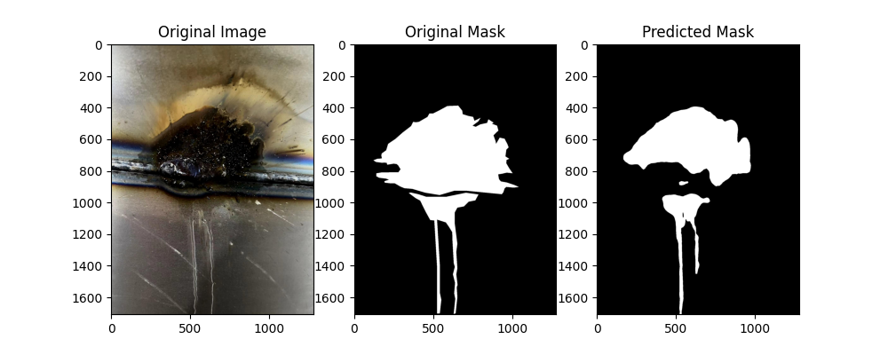
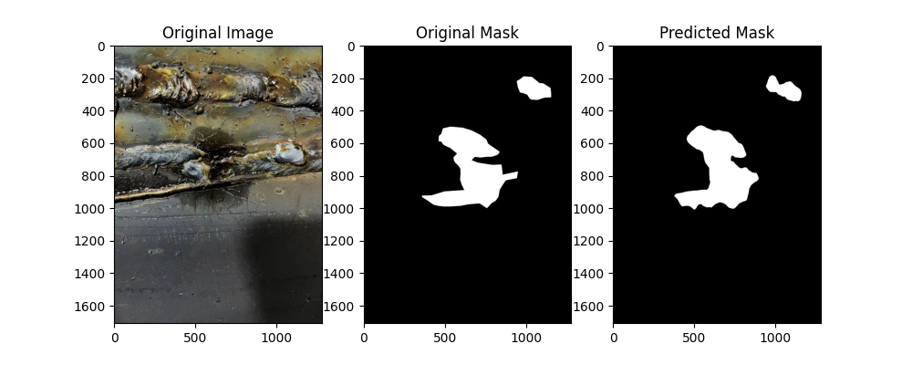
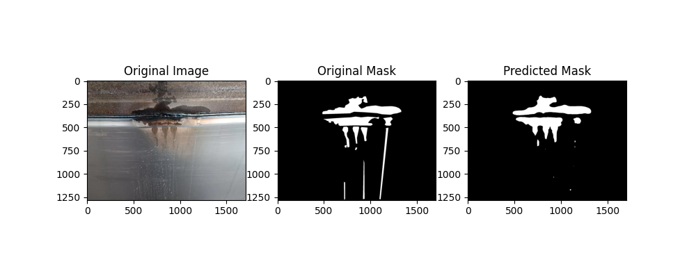
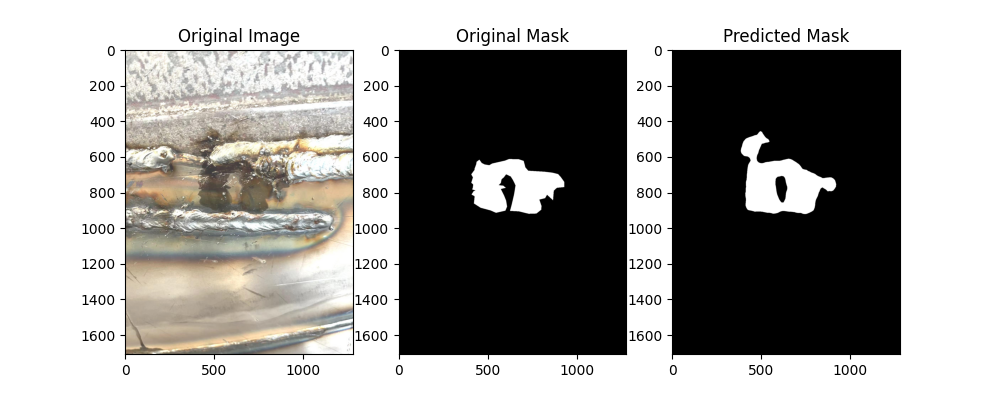
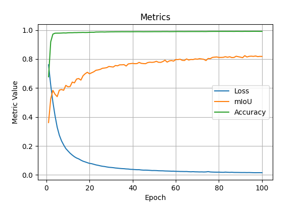

# Weld Defect Segmentation

This project aims to detect weld defects using the Segformer model for semantic segmentation. The model is trained to identify and segment defects in weld images, facilitating automated quality control in welding processes.

## Table of Contents

- [Overview](#overview)
- [Setup and Installation](#setup-and-installation)
- [Dataset](#dataset)
- [Training](#training)
- [Evaluation](#evaluation)
- [Results](#results)
- [Visualization](#visualization)
- [Acknowledgements](#acknowledgements)

## Overview

The project utilizes the Segformer model, a state-of-the-art transformer-based architecture for semantic segmentation, to detect and segment defects in weld images. The model is trained and evaluated on a custom dataset of weld images and corresponding defect masks.

### Sample Detection Results

  
  
  
  


## Setup and Installation

Ensure you have Python 3.8 or later installed and have administrative access to install packages.

1. Clone the repository:

   ```bash
   git clone https://github.com/AbdulazizAnorboev/weld-defect-segmentation.git
   cd weld-defect-segmentation
   ```
   
2. Create a virtual environment and activate it:
   
   ```bash
   python -m venv venv
   source venv/bin/activate  # On Windows: venv\Scripts\activate
   ```

3. Install the required packages:

   ```bash
   pip install -r requirements.txt
   ```


## Dataset

The dataset consists of weld images and corresponding segmentation masks indicating defect regions. The data is split into training, validation, and test sets. The dataset should be organized as follows:

```
data/
├── train/
│   ├── images/
│   └── masks/
├── valid/
│   ├── images/
│   └── masks/
└── test/
    ├── images/
    └── masks/
```

## Training

To train the model, run the following command:

```bash
python train.py
```
The training script will:

- Load the dataset.
- Initialize the Segformer model.
- Train the model for a specified number of epochs.
- Save the best model checkpoint based on validation mIoU.

## Results

The training metrics are saved in `training_metrics.csv`. Below are some key results:

| Metric                   | Value (Epoch)  |
|--------------------------|----------------|
| **Loss** | 0.015597 (100) |
| **mIoU** | 0.823719 (92) |
| **Accuracy** | 0.991696 (97) |

The achieved metrics demonstrate the model’s robustness and its practical applicability in industrial settings where precision and reliability are paramount.

### Training Metrics Plot



## Visualization
The trained model's predictions can be visualized using the visualize.py script. Example visualizations are saved in the output_visualizations directory.
To visualize predictions, run:

```bash
python visualize.py
```
## Evaluation

To evaluate the model on the test set, run the following command:

```bash
python evaluate.py
```
The evaluation script will compute metrics such as mean Intersection over Union (mIoU) and pixel accuracy.

## Acknowledgements
The project uses the Segformer model from Hugging Face's Transformers library.

